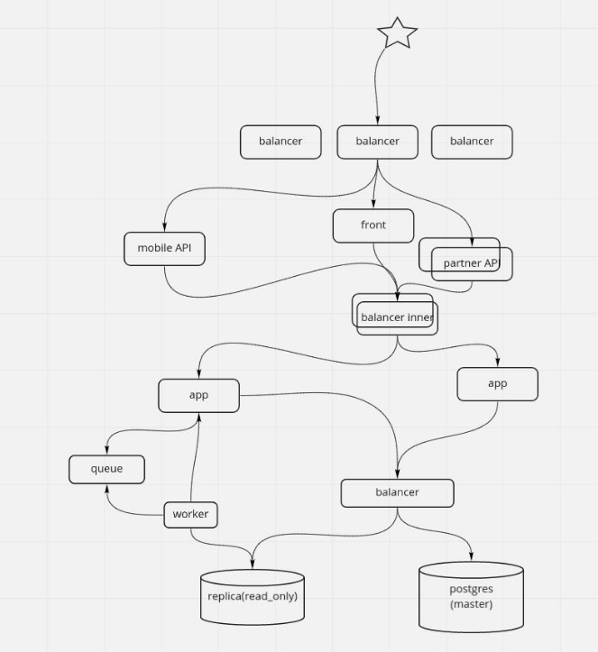

## HH DZ
1) **Представим, что у нас есть данные, которые мы очень часто читаем по сравнению с другими (например, словарь стран). Как можно это оптимизировать?**

    Если необходимо читать именно такой (маленький) объем данных, то можно хранить их в оперативной
    памяти самого сервиса. Также можно попробовать сохранять такой запрос в кэш браузера клиента.
    
    Использовать технологии связанные с хранением данных в памяти.
    Redis прекрасно подходит для организации высокодоступного кэша в памяти, 
    который уменьшает задержку доступа, увеличивает пропускную способность и 
    снижает нагрузку на реляционную базу данных или базу данных NoSQL и на приложение. 
    Redis может обеспечить доступ к часто запрашиваемым данным с задержкой в доли миллисекунды.

    **Плюсы:** 
    Скорость обработки запросов; 
    Можно использовать несколькии сервисами; 

    **Минусы:** 
    Значения не могут превышать 512 МБ; 
    Отсутствует механизм очистки данных; 
    Издержки на tcp соединение; 
    Проблема инвалидации кэша; 
    Потеря данных в кэше при падении Redis. 
    
    Если есть деньги можно попробовать применить CDN.

2) **Что можно сделать, если таблица вакансий стала слишком большой? Какие есть решения на уровне текущей базы данных? Можно ли ее чем-то заменить?** 

    -> Создать дополнительные индексы для поиска; 
        **Плюсы:** 
        Будет выигрыш в скорости при чтении данных; 
        **Минусы:** 
        Индексы займут дополнительное место на диске; 
        Можем просесть при добавлении записей в таблицу. 

    -> Секционировать таблицу на таблички поменьше; 
        **Плюсы:** 
        В определённых ситуациях оно кардинально увеличивает быстродействие, особенно когда большой процент часто запрашиваемых строк таблицы относится к одной или лишь нескольким секциям. Секционирование может сыграть роль ведущих столбцов в индексах, что позволит уменьшить размер индекса и увеличит вероятность нахождения наиболее востребованных частей индексов в памяти; 
        Когда в выборке или изменении данных задействована большая часть одной секции, последовательное сканирование этой секции может выполняться гораздо быстрее; 
        Массовую загрузку и удаление данных можно осуществлять, добавляя и удаляя секции; 
        Редко используемые данные можно перенести на более дешёвые и медленные носители; 
        **Минусы:** 
        Трудность реализации и поддержки. 

    -> Применить масштабирование: 
        Вертикальное — добавление в сервер памяти и дисков. 
        Горизонтальное — распределение данных между несколькими машинами (Шардирование). 
        **Плюсы:** 
        Прирост производительности; 
        **Минусы:** 
        Ограниченность ресурсов и денежных средств. 

    -> Попробовать воспользоваться какими-то NoSQL решениями. 
        **Плюсы:** 
        Прирост производительности; 
        **Минусы:** 
        Усложнение системы из-за добавления новых узлов и необходимости их контролирования. 

3) **Какие вы видите узкие места, возможно неправильно выбранные технологии в текущей схеме (можно рассмотреть как "нашу" схему, так и схему настоящего hh.ru) ?**
    
    
    
    В предложенной нами архитектуре совсем отсутствуют кэши, поэтому необходимо их добавить около API,
    проблемы связанные с этим описаны в пункте 1. Необходимо продублировать queue для повышения надежности.
    Несовсем понятно как app будет записывать данные в БД через балансер, это технически не возможно.
    А даже если и возможно, то необходимо, чтобы во время транзакции сервиса app работа происходила с одной
    и той же базой, иначе данные будут невалидны.
    
    Можно добавить еще несколько worker'ов для генерации отчетов.
    Это необходимо для повышения отказоустойчивости, поможет быстрее генерировать отчеты, если появятся различные типы отчетов.
    Из минусов можно отметить необходимость в покрытии воркеров для новых типов отчетов тестами и неоходимость выделения ресурсов
    для воркеров.
    
    Необходимо добавить balancer между worker'ами и readonly репликами БД, чтобы worker'ы могли работать с различными репликами,
    а не загружать одну. Из минусов получим увеличение времени ответа.
     
